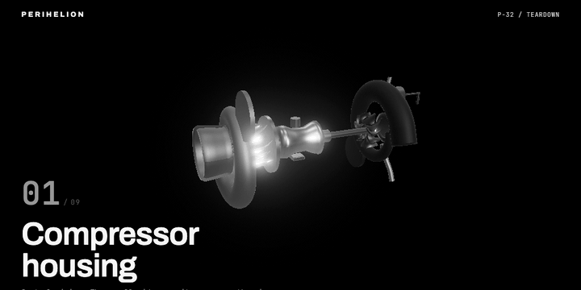
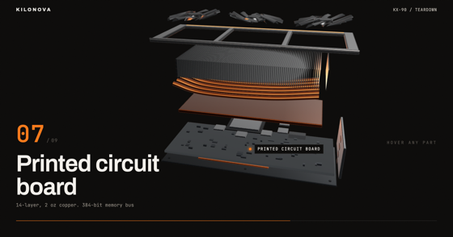
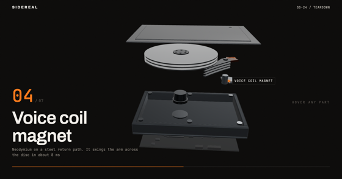

PERIHELION P-32, coming apart on scroll. Rendered live in the browser, not a video file.
<b><a href="https://perihelion-blue.vercel.app">Scroll it yourself</a></b>

I build AI products end to end, then try to break them on purpose. Rising junior at Westford Academy,
heading for generative AI product work with a security habit I am not planning to grow out of.

### Building now

**[FocusOS](https://focusos.live)** is the flagship: an AI study app that adapts to a high schooler's
real attention span rather than a timer someone invented in the 1980s.

**[NYE Media](https://nyemedia.org)** is the nonprofit I co-founded and run the technical side of. We
connect high school builders with the founders, investors and operators who take them seriously. We
hosted our first Innovation Challenge on 27 July 2026 at RSM in Boston: one prompt, five hours, mentors
on the floor, then pitches to a real panel. 501(c)(3) in progress.

### Motion studies

Four objects rebuilt in the browser to work out how motion carries an explanation.
Each is a single scroll: the thing separates along the axis it was assembled on, and
every part names itself on the way out. The turbocharger above is the third of them.

<table>
  <tr>
    <td width="50%">
      
       <b><a href="https://kilonova-eta.vercel.app">KILONOVA KX-90</a></b>
       A graphics card, nine parts, split along its lamination axis
    </td>
    <td width="50%">
      
       <b><a href="https://sidereal-flame.vercel.app">SIDEREAL SD-24</a></b>
       A hard disk drive, seven parts, split along its stacking axis
    </td>
  </tr>
</table>

The fourth one is load bearing: the turbofan on
**[my portfolio](https://myan-portfolio.vercel.app)** keeps spinning while it is pulled apart.

### Shipped

| Project | What it is | Stack |
|---|---|---|
| **[FocusOS](https://focusos.live)** | AI study app that adapts to your real attention span | React · Vite · Supabase · Claude |
| **[SlideAir](https://slideair.vercel.app)** | Present with your hands. Webcam gestures drive slides, laser, blackout, fully on device | React · TypeScript · MediaPipe · WASM |
| **[PromptProbe](https://promptprobe.vercel.app)** | Security scanner for AI chatbots, OWASP LLM Top 10, judged by a second model | React · TypeScript · Vercel Functions |
| **[VulnScan](https://vulnscan-xi.vercel.app)** | OWASP Top 10 static scanner. Paste code or a repo link, get findings in seconds | React · Supabase Edge · AI |
| **[SlideStack](https://slidestack-beta.vercel.app)** | Type a topic, get ready to post Instagram carousels. Fully client side, bring your own key | React · Canvas · Fable |
| **[RepoRoast](https://reporoast-alpha.vercel.app)** | An AI roast host drags your GitHub, then hypes you up. Shareable heat score | React · Vite · Claude Haiku |
| **[fable-jarvis](https://www.npmjs.com/package/fable-jarvis)** | A terminal assistant on the Claude Agent SDK. `npm i -g fable-jarvis` | TypeScript · Agent SDK |
| **[etf-research-mcp](https://www.npmjs.com/package/etf-research-mcp)** | Published MCP server giving Claude live ETF research tools | TypeScript · MCP |
| **[keyhound](https://github.com/myanptl/keyhound)** | Dependency free CLI that scans code and full git history for leaked secrets | Python · Security |

### Contribution graph, being eaten

<picture>
  <source media="(prefers-color-scheme: dark)" srcset="https://raw.githubusercontent.com/myanptl/myanptl/output/snake-dark.svg">
  <source media="(prefers-color-scheme: light)" srcset="https://raw.githubusercontent.com/myanptl/myanptl/output/snake-light.svg">
  
</picture>

### Off the keyboard

Completed all 18 Anthropic Academy certifications and YC Startup School. Finished Suffolk University's
pre college entrepreneurship program and the Summit STEM Fellowship in summer 2026. Youth Ambassador
for the American India Foundation's Digital Equalizer program. Beginner ETF investor, which is where
the finance tooling comes from.

### Elsewhere

[Portfolio](https://myan-portfolio.vercel.app) · [LinkedIn](https://www.linkedin.com/in/myan-patel-1857943ba/) · [NYE Media](https://nyemedia.org)

Still in high school. Still shipping.
